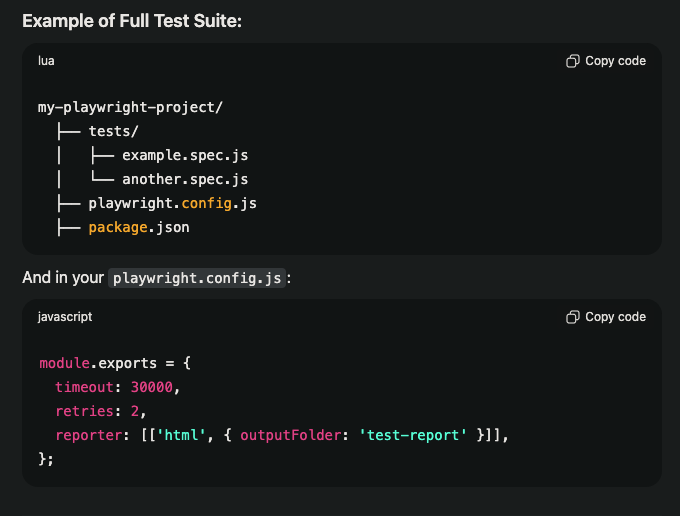

## Setup In WebStorm
Install node.js from https://nodejs.org/en/
1. Run: `npm init -y`
2. Install Playwright: `npm install playwright`
3. Install Browsers: `npx playwright install`
4. Install playwright tests: `npm install playwright @playwright/test`
5. Install json2csv: `npm install json2csv`
5. code gen: `npx playwright codegen` or `npx playwright codegen {websight to goto}`
6. run script: `node index.js`
7. run script in bulk: `npx playwright test`
8. run script with path: `npx playwright test tests/example.spec.js`
9. run script with reporter: `npx playwright test --reporter=html`
10. run script with head mode: `npx playwright test --headed`
11. run scripts with workers: `npx playwright test --workers=4` *note looks like it run autoworkers
12. run scripts with config file: `npx playwright test --config=playwright.config.js`
13. run script with flags: `npx playwright test -g 'Test A'`
14. *note look into node.js + MCP + Playwright
15. run script: `npm install playwright @modelcontextprotocol/sdk` - install MCP
16. create server file see server.js - run server.js 
17. install ampcode `sudo npm install -g @sourcegraph/amp`
18. run amp for jetbrains IEDs `amp --jetbrains`
19. run MCP Server `node server.js`
20.  • npm test - all tests in headless                                                                                                                                                                                                                              █
     • npm run test:headed - all tests headed                                                                                                                                                                                                                        █
     • npm run test:suite - specific test suite

## example setup 
